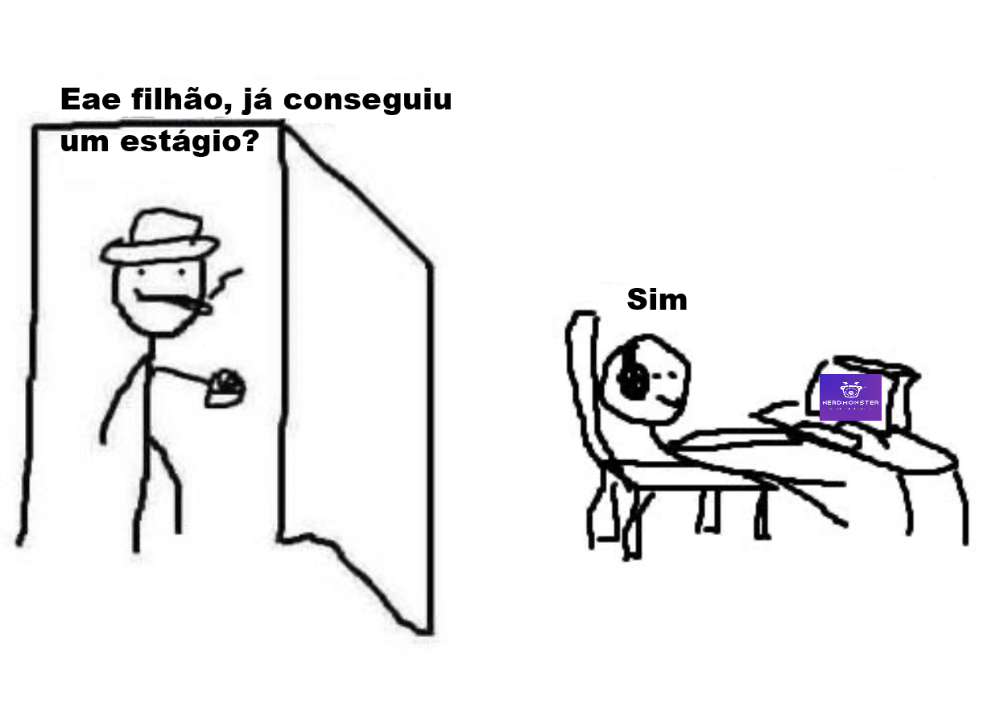

## Bem-vindo! Bagunça em construção, não repare nos repositórios!

  
┌─  Sobre mim   ─────────────────────────────────────────────────┐  
| Aluno de Sistemas de Computação na UFF desde 2025              |  
| Entusiasta de Desenvolvimento em Java                          |  
| Desenvolvedor de aleatoriedades em Python nos finais de semana |  
└────────────────────────────────────────────────────────────────┘  

┌─  Projetos    ──────────────────────────────────────────────────┐  
| [Damas CLI](https://github.com/pedro-seco/py-damas)             |  
| [(De)Codificador Morse](https://github.com/pedro-seco/py-morse) |  
| [JoKenPo](https://github.com/pedro-seco/java-jokenpo)           |   
└─────────────────────────────────────────────────────────────────┘
